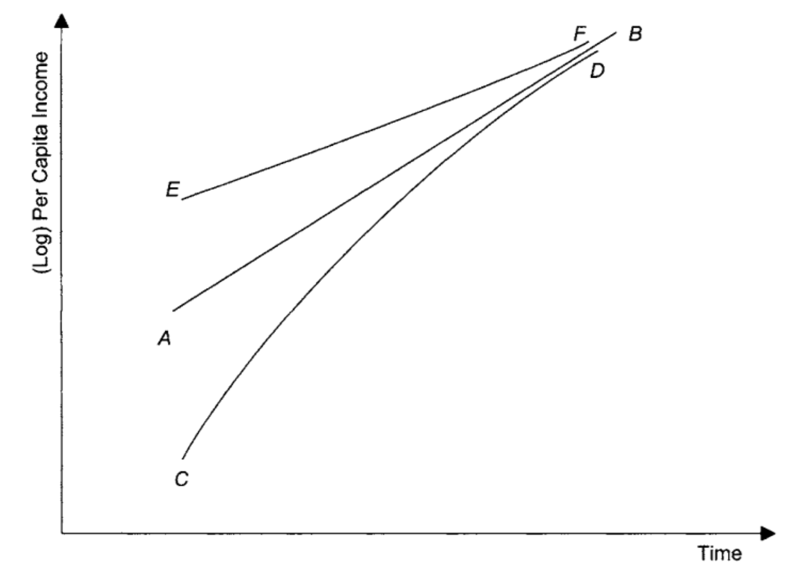
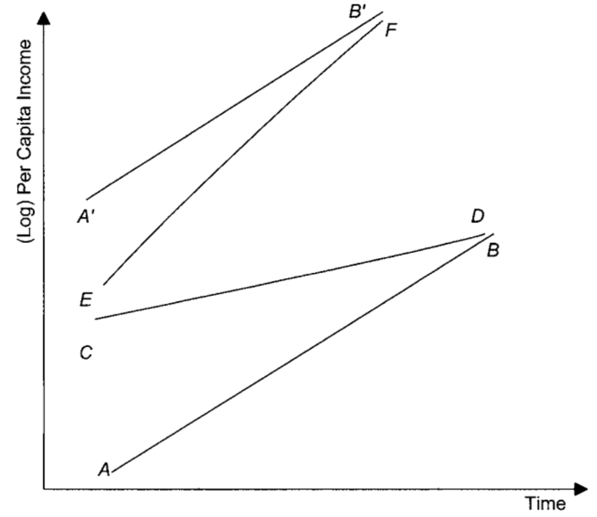
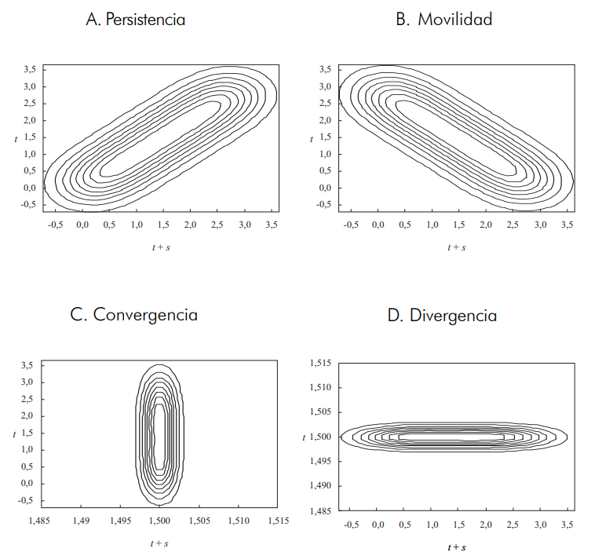
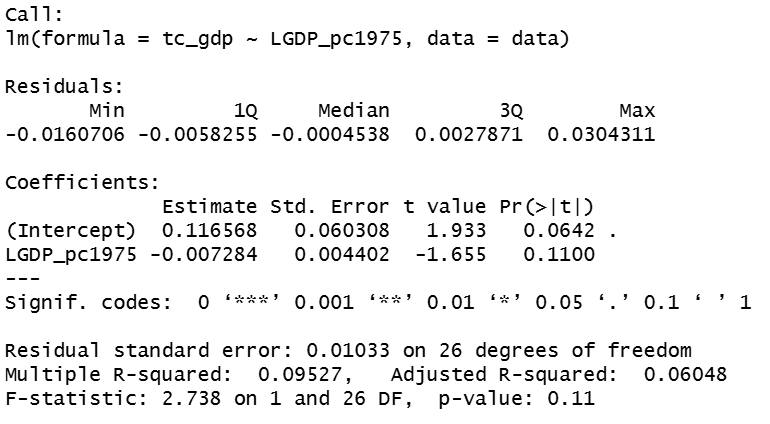
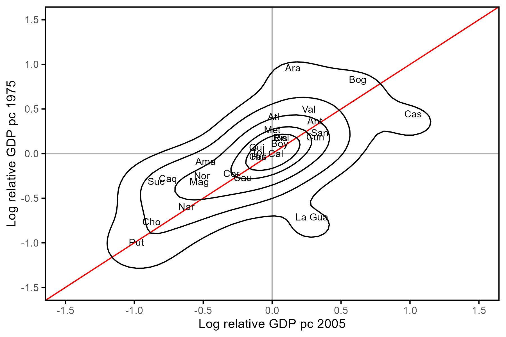
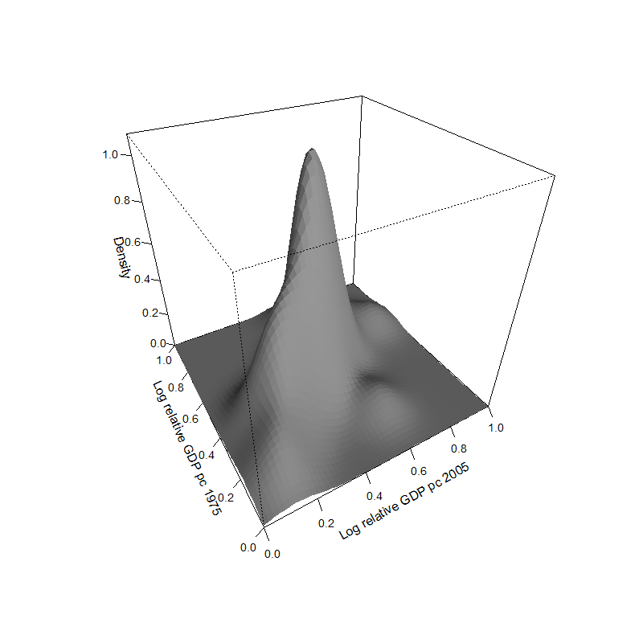

```{r setup, include = F}
# This is the recommended set up for flipbooks
# you might think about setting cache to TRUE as you gain practice --- building flipbooks from scratch can be time consuming
options(width = 70)
knitr::opts_chunk$set(
  dev.args = list(bg = 'transparent'),
  fig.width = 12, message = TRUE,
  warning = FALSE, comment = "", cache = TRUE, fig.retina = 3
)
knitr::opts_knit$set(global.par = TRUE)
Sys.setenv(`_R_S3_METHOD_REGISTRATION_NOTE_OVERWRITES_` = "false")
# remotes::install_github("luukvdmeer/sfnetworks")
# remotes::install_github("EvaMaeRey/flipbookr")
# remotes::install_github("rlesur/klippy")
# devtools::install_github("gadenbuie/xaringanExtra")
library(flipbookr)
library(xaringanthemer)
library(tidyverse)
library(klippy)
library(xaringanExtra)
library(gt); library(knitr); library(kableExtra); library(tibble)
library(summarytools)
```

<style>
.notbold{
    font-weight:normal
}

body {
text-align: justify;
}

h1{
      margin-top: -1px;
      margin-bottom: -3px;
}

.small-code pre{
  margin-bottom: -10px;
  
}  

.medium-code pre{
  margin-bottom: 2px;
  
}

p.comment {
background-color: #E1E1FF;
padding: 10px;
border: 1px solid white;
margin-left: 25px;
border-radius: 15px;
text-align: justify;
}

div.block { 
background-color: #E1E1FF;
padding: 10px;
border: 1px solid white;
margin-left: 25px;
border-radius: 15px;
text-align: justify;
}

</style>

```{r xaringan-scribble, echo=FALSE}
xaringanExtra::use_scribble()
```

```{r xaringanExtra-clipboard, echo=FALSE}
htmltools::tagList(
  xaringanExtra::use_clipboard(
    button_text = "<i class=\"fa fa-clipboard\"></i>",
    success_text = "<i class=\"fa fa-check\" style=\"color: #90BE6D\"></i>",
    error_text = "<i class=\"fa fa-times-circle\" style=\"color: #F94144\"></i>"
  ),
  rmarkdown::html_dependency_font_awesome()
)
```

```{r xaringan-extra-styles, echo=FALSE}
xaringanExtra::use_extra_styles(
  hover_code_line = TRUE,         #<<
  mute_unhighlighted_code = TRUE  #<<
)
```
<font size = "5">

<br>
<br>
<br>
<br>
<br>

Link slides en formato [html](https://gusgarciacruz.github.io/EconometriaEspacial/Convergencia/Convergencia.html)

Link slides en formato [PDF](https://gusgarciacruz.github.io/EconometriaEspacial/Convergencia/Convergencia.pdf)

---
# <span style="font-size:80%">En este tema</span>

- <span style="font-size:150%">[<span style="color:black">Motivación](#motivacion)</span> <br>

- <span style="font-size:150%">Conceptos de convergencia</span>
<p style="margin-bottom: -1em">
  - <span style="font-size:140%">[<span style="color:black"> $\beta$-convergencia no condicional y condicional](#beta)</span>
  - <span style="font-size:140%">[<span style="color:black"> $\sigma$-convergencia](#sigma)</span>
  
- <span style="font-size:150%">[<span style="color:black">Un enfoque alternativo: Kernel estocásticos](#kernel)</span> 

- <span style="font-size:150%">[<span style="color:black">Ejemplo: convergencia interregional del GDP per cápita en Colombia](#ejem)</span> 

---
# <span style="font-size:80%">Lecturas</span>
<font size = "5">

- Sala-i-Martin, X. (1999). *Apuntes de Crecimiento Económico, Antoni Bosch Editor*. <span style="color:blue">Cap. 10</span> 

- Ray, D. (1998). *Development Economics*, Princeton University Press. <span style="color:blue">Cap. 3</span>

- Royuela V. y García, G. (2015). "Economic and Social Convergence in Colombia'', *Regional Studies*, 49(2):219-239.

- Ardila, L. (2004).  "Gasto Público y Convergencia Regional en Colombia", *Revista Ensayos Sobre Política Económica*, 45:222-268.

- Rey, S. y Montouri, B. (1999). "US Regional Income Convergence: a Spatial Econometric Perspective". *Regional Studies*, 33(2):143-156.

- Aristizábal, J. y García, G. (2021). "Regional Economic Growth and Convergence: The Role of Institutions and Spillover Effects in Colombia". *Regional Science Policy & Practice*, 13(4):1146-1162.

---
name: motivacion
# <span style="font-size:80%">Motivación</span>

<spam style="font-size:120%">

- El problema del crecimiento económico siempre ha sido el foco de los teóricos, ya que éste es una condición necesaria para el mejoramiento del estándar de vida de una sociedad

- El análisis formal de la convergencia económica data de los años cincuenta con el modelo de Solow-Swam y se ha extendido hasta la actualidad con el modelo de crecimiento neoclásico

- La existencia de convergencia se propuso como el test fundamental que tenía que distinguir entre los nuevos modelos de crecimiento endógeno y los modelos neoclásicos tradicionales de crecimiento exógeno:
<p style="margin-bottom: -1em">
	- Modelos de crecimiento endógeno: rendimientos positivos y no decrecientes de los factores e ignoran la posibilidad de convergencia
	-	Modelos de crecimiento exógeno: rendimientos decrecientes de los factores y la convergencia de las economías a un equilibrio de largo plazo
	

- Existen diferentes definiciones de convergencia, pero las más utilizadas son:
<p style="margin-bottom: -1em">
 - <span style="color:blue"> $\beta$-convergencia</span>: las economías pobres crecen más que las ricas $\Longrightarrow$ hay $\beta$-convergencia si existe una relación inversa entre la tasa de crecimiento de la renta (o el PIB) y el nivel inicial de dicha renta
 -	<span style="color:blue"> $\sigma$-convergencia</span>: la dispersión de la renta real per cápita entre grupos de economías tiende a reducirse con el tiempo

---
name: beta
# <span style="font-size:80%">Conceptos de convergencia: $\beta$-convergencia</span>

<font size = "5">

- Es la relación inversa entre la tasa de crecimiento de la renta (o el PIB) entre dos momentos del tiempo y el logaritmo de su nivel inicial del dicho período, relación que se estima con una ecuación econométrica entre las dos variables

- Este tipo de convergencia establece cómo economías con bajo nivel de renta crecerán más rápido que las economías con altas rentas iniciales

- Existen dos tipos de $\beta$-convergencia que se pueden establecer de acuerdo a las características del grupo de economías a estudiar
<p style="margin-bottom: -1em">
	- No condicional o absoluta
	-	Condicional o relativa

---
# <span style="font-size:80%">Conceptos de convergencia: $\beta$-convergencia no condicional</span>
<font size = "4">

- En el corazón del modelo de Solow está la predicción de la convergencia no condicional

- Se postula que los países, en el largo plazo, no tendrán diferencias en las tasas de progreso técnico, ahorro, tasa de crecimiento de la población y depreciación del capital, por lo que el modelo predice que todos los países convergerán a un mismo estado estacionario de renta
	
- El mismo estado estacionario se alcanza independientemente del estado inicial de cada una de la economías $\Longrightarrow$ <span style="color:blue">la historia en el sentido de diferentes condiciones iniciales no importan </span>

.pull-left-50[
```{r, echo=FALSE, out.width="95%",fig.align='center'}

```
]

.pull-right-50[
La línea AB representa la trayectoria temporal de la (log) renta per cápita en el estado estacionario

CD: este país mostrará inicialmente una tasa de crecimiento que supera el nivel de equilibrio, y su trayectoria temporal se desplazará asintóticamente hacia la línea AB 

EF: este país comienza por encima del estado estacionario, experimentará una tasa de crecimiento menor, ya que su trayectoria temporal EF se aplana para converger en la línea AB desde arriba

<span style="color:blue">Convergencia: se indica mediante una fuerte relación negativa entre las tasas de crecimiento de la renta per cápita y el valor inicial de la renta per cápita.
]

---
# <span style="font-size:80%">Conceptos de convergencia: $\beta$-convergencia no condicional</span>
<spam style="font-size:105%">

La hipótesis de $\beta$-convergencia sugiere que la tasa de crecimiento es una función negativa del nivel de renta en $t-1$ y puede escribirse como:

$$log\left(\frac{y_{it}}{y_{i0}}\right)=a-\beta log(y_{i0})+u_{it}$$


donde $u_{it}$ es un término de perturbación y $\beta$ es una constante positiva tal que $0<\beta<1$. Un mayor coeficiente $\beta$ corresponde a una mayor tendencia hacia la convergencia

Barro y Sala-i-Martin (1991) sugieren estimar una relación no lineal como la siguiente:

$$\left(\frac{1}{T}\right)log\left(\frac{y_{it}}{y_{i0}}\right)=a-\frac{1-e^{-\beta T}}{T}log(y_{i0})+u_{it}$$
$$\left(\frac{1}{T}\right)log\left(\frac{y_{it}}{y_{i0}}\right)=a-blog(y_{i0})+u_{it}$$

$\beta=ln(1-Tb)/T$ es la velocidad de convergencia, entre mayor sea, más corto será el tiempo tomado por las distintas economías para alcanzar el equilibrio de largo plazo. A partir de esta velocidad de convergencia se puede calcular también el tiempo necesario para cerrar la mitad de la brecha entre la renta de las regiones pobres y ricas ($ln(2)/\beta$)

La ecuación lineal y no lineal arrojan resultados bastante parecidos, así que en muchos trabajos empíricos se opta por estimar la forma lineal por simplicidad

---
# <span style="font-size:80%">Conceptos de convergencia: $\beta$-convergencia condicional</span>
<spam style="font-size:105%">

- A principios de los años noventa, los economistas neoclásicos hicieron su propias contrarevoluciones. Sala-i-Martin (1990), Barro y Sala-i-Martin (1991, 1992a, 1992b) y Mankiw, Romer y Weil (1992) negaron el hecho de que el modelo neoclásico hiciera la predicción de convergencia

- El argumento fue el siguiente: <span style="color:blue">si los parámetros tecnológicos de preferencias e institucionales de dos economías neoclásicas son distintos, entonces las dos economías se acercarán a dos estados estacionarios distintos

.pull-left-50[
```{r, echo=FALSE, out.width="88%",fig.align='center'}

```
]

.pull-right-50[
Ahora cada país tiene su propia trayectoria hacia el estado estacionario (AB y A'B')

Se supune que todas estas trayectorias son paralelas entre sí, dado que los países tienen la misma tasa de progreso técnico (y, por lo tanto, las mismas tasas de crecimiento al estado estacionario)

El modelo de Solow predice que, con el tiempo, el país que empezó en C, por encima del estado estacionario, mostrará una tasa de crecimiento más lenta que la trayectoria del estado estacionario AB. 

Un país que comienza en el punto E por debajo de su trayectoria del estado estacionario A'B' mostrará una tasa de crecimiento superior a la del estado estacionario

]

---
# <span style="font-size:80%">Conceptos de convergencia: $\beta$-convergencia condicional</span>
<font size = "5">

- Para probar el modelo neoclásico, había que ir más allá de la convergencia absoluta y se tenía que medir de alguna manera la distancia entre el nivel de renta de un país y su nivel de renta en el estado estacionario

- Empíricamente, hay por lo menos dos formas de ''condicionar'' los datos:
<p style="margin-bottom: -1em">
	- <span style="color:blue">Limitar el estudio a un conjunto de economías parecidas</span>: individuos con preferencias similares, con instituciones y sistemas impositivos y legales parecidos y empresas que se enfrentan a funciones de producción parecidas
	
	- <span style="color:blue">Modelos de regresión múltiple</span>: si se efectúa una regresión con datos de sección cruzada del crecimiento sobre la renta inicial, manteniendo constante un cierto número de variables adicionales (que actúan como *proxy* del estado estacionario), y encontramos que el coeficiente de la renta inicial es negativo, entonces decimos que las economías en nuestro conjunto de datos presenta $\beta$-convergencia condicional 

---
name: sigma
# <span style="font-size:80%">Conceptos de convergencia: $\sigma$-convergencia</span>
<font size = "5">

- $\sigma$-convergencia corresponde a la disminución de la dispersión a nivel de sección cruzada en la variable bajo análisis

- Diferentes medidas han sido empleadas para analizar la dispersión: la desviación estándar, el coeficiente de variación y el índice de Theil

- Puede haber $\beta$-convergencia y $\sigma$-convergencia, por lo que $\beta$-convergencia no es una condición suficiente para la existencia de $\sigma$-convergencia. Sala-i-Martin (1996) sugiere calcular las dos medidas

- Los conceptos de $\beta$-convergencia y $\sigma$-convergencia son distintos aunque están relacionados. La existencia de $\beta$-convergencia es una condición necesaria para la existencia de $\sigma$-convergencia 

---
name: kernel
# <span style="font-size:80%">Un enfoque alternativo: Kernel estocásticos</span>
<spam style="font-size:115%">

El análisis tradicional de convergencia visto anteriormente ha sido criticado por autores como Quah (1993, 1995, 1996) y Bernard y Durlauf (1994)

**<span style="color:blue">Critica 1</span>**
<p style="margin-bottom: -1em">
- La ecuación de convergencia intenta mostrar la presencia de convergencia en el sentido que los países pobres eventualmente alcanzan a los ricos $\Longrightarrow$ <span style="color:blue">Quah demuestra que un coeficiente negativo acompañando el nivel de ingreso es perfectamente consistente con la ausencia de convergencia de este tipo
- Cualquier regresión de las tasas de crecimiento promedio en un periodo de tiempo respecto a una condición inicial, siempre tiene coeficiente negativo aunque la distribución permanezca invariante en el tiempo $\Longrightarrow$ La falacia de Galton de regresión hacia la media

**<span style="color:blue">Critica 2</span>**
<p style="margin-bottom: -1em">
- La otra critica de Quah (1996) es que si la estructura económica es tan distinta en cada sitio, ésta no puede ser la explicación de que se encuentren la uniformidad del 2\% en las tasas de convergencia
- La explicación a este hecho estaría entonces en algo poco interesante desde el punto de vista del
problema que se está estudiando, como sería la existencia de una raíz unitaria en las series 

---
# <span style="font-size:80%">Un enfoque alternativo: Kernel estocásticos</span>
<spam style="font-size:115%">

**<span style="color:blue">Critica 3</span>**
<p style="margin-top: -1em">
Quah (1996) también critica el concepto de convergencia tipo $\sigma$, en el sentido de que no tiene en cuenta la movilidad de las economías en el interior de la distribución

<p style="margin-bottom: 1em">
	
.pull-left-50[
```{r, echo=FALSE, out.width="88%",fig.align='center'}
knitr::include_graphics("g3.png")
```
> Las sendas que siguen dos economías en el tiempo, las cuales se caracterizan por una alta movilidad, pasando de un lado a otro del estado estacionario, mientras que la desviación estándar ($\sigma$) no cambia
]

.pull-right-50[
```{r, echo=FALSE, out.width="88%",fig.align='center'}
knitr::include_graphics("g4.png")
```
> $\sigma$ no cambia, pero la desigualdad persiste en el tiempo
]

---
# <span style="font-size:80%">Un enfoque alternativo: Kernel estocásticos</span>
<font size = "5">

Conclusiones de Quah:
<p style="margin-bottom: -1em">
- $\beta$-convergencia no dice nada acerca de la dinámica de la distribución, ya que se obtiene un coeficiente negativo en la ecuación de convergencia aunque no haya convergencia

- $\sigma$-convergencia no captura la dinámica en el interior de la distribución

- El análisis de datos panel no muestra la dinámica de la distribución, ya que éste sólo registra el comportamiento de la media condicional y no de la distribución completa

- Es un error sacar conclusiones dinámicas de las regresiones de convergencia, ya que éstas son estimaciones estáticas  

---
# <span style="font-size:80%">Un enfoque alternativo: Kernel estocásticos</span>
<font size = "5">

- Quah hace su propia propuesta para analizar la convergencia y se basa en la estimación de <span style="color:blue">kernels estocósticos</span>

- Esta metodología permite ver cómo evoluciona una distribución en el tiempo, al igual que los movimientos en el interior de la misma

- <span style="color:blue">Kernels estocósticos</span>: es una función de distribución de probabilidad dinámica
	
- El método estadístico que se usa para aproximar a esta función de distribución es la estimación de densidad de kernel. Ésta densidad en su forma mÁs simple puede ser pensado como un histograma suavizado. Se tienen tres tipos de kernels:
<p style="margin-bottom: -1em">
  - Univariado: muestra una foto de la distribuciÓn de la renta entre regiones en un momento $t$ del tiempo
  - Bivariado: permite ver cómo cambia la distribución entre $t$ y $t+s$ (líneas de contorno)
  -	Trivariado: función de distribución de probabilidad dinámica, que se representa en tres dimensiones donde el eje z es la función de densidad

---
# <span style="font-size:80%">Un enfoque alternativo: Kernel estocásticos</span>
<spam style="font-size:105%">

A nivel bivariante se pueden observar los siguientes casos:

```{r, echo=FALSE, out.width="42%",fig.align='center'}

```

<span style="color:blue">Persistencia</span>: la distribución no cambia, los pobres siguen siendo pobres y los ricos ricos
<span style="color:blue">Movilidad</span>: los ricos son pobres y viceversa<br>
<span style="color:blue">Convergencia</span>: en $t+s$ la distribución se concentra en un punto<br>
<span style="color:blue">Divergencia</span>: en $t$ la distribución se concentra en un punto


---
name: ejem
# <span style="font-size:80%">Ejemplo: convergencia interregional del GDP per cápita en Colombia</span>
<spam style="font-size:105%">

Datos del paper: Royuela V. y García, G. (2015). "Economic and Social Convergence in Colombia", *Regional Studies*, 49(2):219-239

- [Datos](https://gusgarciacruz.github.io/EconometriaEspacial/Convergencia/data1.csv)
- [Código en R](https://gusgarciacruz.github.io/EconometriaEspacial/Convergencia/L4_2.R)


```{r, echo=FALSE, out.width="50%",fig.align='center'}

```

Velocidad de convergencia = $\frac{ln(1-T\widehat{b})}{T}=\frac{ln(1-31(-0.007284)}{31}=0.006567434$

La velocidad de convergencia es 0.65%, lo cual sugiere que se requieren 105.5 años ($ln2/$velocidad de convergencia) para cerrar en la mitad la brecha entre los PIB per cápita de las regiones pobres y ricas

---
# <span style="font-size:80%">Ejemplo: convergencia interregional del GDP per cápita en Colombia</span>
<spam style="font-size:105%">

.pull-left-50[
<br>
<br>
<br>
<br>
```{r, echo=FALSE, out.width="95%",fig.align='center'}

```
]

.pull-right-50[
```{r, echo=FALSE, out.width="100%",fig.align='center'}

```
]

