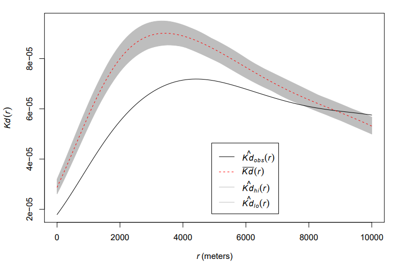
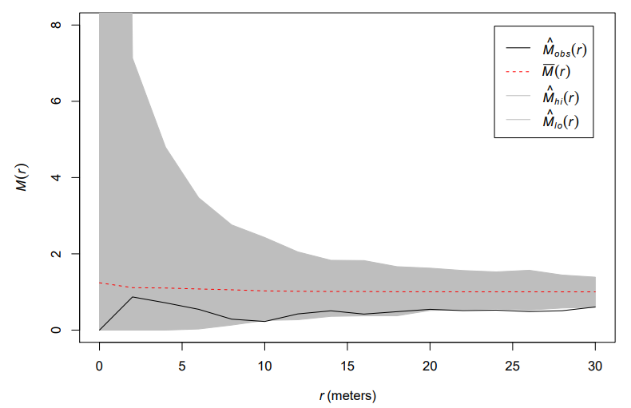

```{r setup, include = F}
# This is the recommended set up for flipbooks
# you might think about setting cache to TRUE as you gain practice --- building flipbooks from scratch can be time consuming
options(width = 70)
knitr::opts_chunk$set(
  dev.args = list(bg = 'transparent'),
  fig.width = 12, message = TRUE,
  warning = FALSE, comment = "", cache = TRUE, fig.retina = 3
)
knitr::opts_knit$set(global.par = TRUE)
Sys.setenv(`_R_S3_METHOD_REGISTRATION_NOTE_OVERWRITES_` = "false")
# remotes::install_github("luukvdmeer/sfnetworks")
# remotes::install_github("EvaMaeRey/flipbookr")
# remotes::install_github("rlesur/klippy")
# devtools::install_github("gadenbuie/xaringanExtra")
library(flipbookr)
library(xaringanthemer)
library(tidyverse)
library(klippy)
library(xaringanExtra)
library(gt); library(knitr); library(kableExtra); library(tibble)
library(summarytools)
```

<style>
.notbold{
    font-weight:normal
}

body {
text-align: justify;
}

h1{
      margin-top: -1px;
      margin-bottom: -3px;
}

.small-code pre{
  margin-bottom: -10px;
  
}  

.medium-code pre{
  margin-bottom: 2px;
  
}

p.comment {
background-color: #E1E1FF;
padding: 10px;
border: 1px solid white;
margin-left: 25px;
border-radius: 15px;
text-align: justify;
}

div.block { 
background-color: #E1E1FF;
padding: 10px;
border: 1px solid white;
margin-left: 25px;
border-radius: 15px;
text-align: justify;
}

</style>

```{r xaringan-scribble, echo=FALSE}
xaringanExtra::use_scribble()
```

```{r xaringanExtra-clipboard, echo=FALSE}
htmltools::tagList(
  xaringanExtra::use_clipboard(
    button_text = "<i class=\"fa fa-clipboard\"></i>",
    success_text = "<i class=\"fa fa-check\" style=\"color: #90BE6D\"></i>",
    error_text = "<i class=\"fa fa-times-circle\" style=\"color: #F94144\"></i>"
  ),
  rmarkdown::html_dependency_font_awesome()
)
```

```{r xaringan-extra-styles, echo=FALSE}
xaringanExtra::use_extra_styles(
  hover_code_line = TRUE,         #<<
  mute_unhighlighted_code = TRUE  #<<
)
```
<font size = "5">

<br>
<br>
<br>
<br>
<br>

Link slides en formato [html](https://gusgarciacruz.github.io/EconometriaEspacial/EcoAglomeracion/EcoAglomeracion.html)

Link slides en formato [PDF](https://gusgarciacruz.github.io/EconometriaEspacial/EcoAglomeracion/EcoAglomeracion.pdf)

---
# <span style="font-size:80%">En este tema</span>

- <span style="font-size:150%">[<span style="color:black">Motivación](#motivacion)</span> <br>

- <span style="font-size:150%">[<span style="color:black">Economías de aglomeración](#ecoaglomera)</span> <br>

- <span style="font-size:150%">[<span style="color:black">Fuentes de las economías de aglomeración](#fuentes)</span> 
<p style="margin-bottom: -1em">
  1. <span style="font-size:140%">[<span style="color:black">Desbordamiento de conocimiento (learning)](#learning)</span>
  2. <span style="font-size:140%">[<span style="color:black">Insumos locales no comerciables (sharing)](#sharing)</span>
  3. <span style="font-size:140%">[<span style="color:black">Mano de obra calificada local (matching)](#matching)</span>

- <span style="font-size:150%">[<span style="color:black">Los tipos de economías de aglomeración](#tipos)</span> <br>

- <span style="font-size:150%">[<span style="color:black">Midiendo las economías de aglomeración](#midiendo)</span> <br>
<p style="margin-bottom: -1em">
  1. <span style="font-size:140%"><span style="color:black">Índice de Ellison y Glaeser (EG)</span>
  2. <span style="font-size:140%">[<span style="color:black">Índice de Maurel y Sédillot (1999) (MS)](#ms)</span>
  3. <span style="font-size:140%">[<span style="color:black">Medidas de especialización espacial](#esp)</span>
  4. <span style="font-size:140%">[<span style="color:black">Medidas de concentración espacial basadas en la distancia](#dis)</span>

- <span style="font-size:150%">[<span style="color:black">Ejercicio aplicado en R](#r)</span> 

---
# <span style="font-size:80%">Lecturas</span>
<font size = "4">
<p style="margin-bottom: -1em">
- Duranton G. y Puga D. (2004). ''Micro-Foundations of Urban Agglomeration Economies''. En: Henderson J, Thisse J (eds) Handbook of Regional and Urban Economics, vol 4, pp 2063–2117.

- Rosenthal, S. y Strange, W. (2004). ''Evidence on the Nature and Sources of Agglomeration Economies''. En: Henderson J, Thisse J (eds) Handbook of Regional and Urban Economics, vol 4, pp 2019-2171.

- Puga D. (2010). ''The Magnitude and Causes of Agglomeratios Economies''. *Journal of Regional Science*, 50(1):203-219.

- Ellison G. y Glaeser E.L. (1997). ''Geographic Concentration in U.S. Manufacturing Industries: A Dartboard Approach''. *Journal of Political Economy*, 105(5):889-927. 

- Marcon, E. y Puech, F. (2017). ''A Typology of Distance-based Measures of Spatial Concentration'', *Regional Science and Urban Economics*, 62:56-67.

- Lang, G., Marcon, E. y Puech, F. (2017). ''Distance‑based measures of spatial concentration: introducing a relative density function'', *The Annals of Regional Science*, 64:243–265.

- García, G. y Moreno-Monroy, A. (2016). ''Intra-metropolitan Clustering of Formal and Informal Manufacturing Activity: Evidence from Cali, Colombia'', *Tijdschrift voor economische en sociale geografie*, 107(4):389–406.

---
name: motivacion
# <span style="font-size:80%">Motivación</span>
<font size = "5">

En esta sección se analizan las razones de la concentración de la actividad económica:
<p style="margin-bottom: -1em">
- determinar por qué las actividades están generalmente agrupadas, juntas geográficamente

- las razones de por qué las firmas a menudo están concentradas juntas en el espacio

- medir el grado de concentración

---
name: ecoaglomera
# <span style="font-size:80%">Economías de aglomeración</span>
<font size = "5">

- Existen ventajas y es más eficiente gestionar las relaciones personales, sociales, económicas y de poder de forma espacialmente concentrada

- Existen importantes ventajas económicas con una estructura espacial concentrada

- Se asocian a un ahorro de costos derivado de la concentración de las empresas

- La mayor eficiencia de un modelo concentrado reside en la <span style="color:blue">indivisibilidad</span> o <span style="color:blue">economías a escala</span> $\Longrightarrow$ <span style="color:blue">solamente alcanzando una dimensión o una escala suficiente de actividad es posible utilizar procesos productivos más eficientes</span>

- Alfred Marshall (1890, 1920) fue el primero en proveer una detallada descripción de las fuentes de las economías de aglomeración

- Marshall: las economías de aglomeración son generalmente entendidas a ser economías externas $\Longrightarrow$ <span style="color:blue">son independientes a una sola firma, pero las cuales se acumulan a todas las firmas localizadas en la misma  área

---
name: fuentes
# <span style="font-size:80%">Fuentes de las economías de aglomeración</span>
<font size = "5">

- Para que la concentración se genere, las firmas tienen que alcanzar retornos crecientes a escala

- Marshall describió  tres razones por lo cuales  éstas economías a escala pueden alcanzarse:
<p style="margin-bottom: -1em">
  1. desbordamiento de conocimiento (<span style="color:blue">learning</span>)
	2. Insumos locales no comerciables (<span style="color:blue">sharing</span>)
	3. mano de obra calificada local (<span style="color:blue">matching</span>)

---
name: learning
# <span style="font-size:80%">Fuentes de las economías de aglomeración: learning</span>
<font size = "5">

- Las firmas concentradas en una misma localización puede implicar que existe una alta interacción de los trabajadores entre las firmas $\Longrightarrow$ <span style="color:blue">fácil contacto en términos de negocios o de una forma más informal como relaciones sociales</span>
<p style="margin-bottom: -.6em">
- Esta interacción social permite una transmisión de conocimientos tácitos
<p style="margin-bottom: -.6em">
- <span style="color:blue">Conocimientos tácitos</span>: conocimientos o información que es incompleta, que es compartida sobre la base de relaciones de no-mercado y pueden relacionarse con temas de nuevos productos, personal, tecnología y tendencias del mercado
<p style="margin-bottom: -.6em">
- Esta transmisión de información permite a cada individuo construir una visión del comportamiento del mercado y por tanto mejorar sus habilidades en  éste 
<p style="margin-bottom: -.6em">
- <span style="color:blue">Entre más participantes existan en el área local, más completa será  la información de cada individuo</span>
<p style="margin-bottom: -.6em">
- <span style="color:blue">La ventaja de la clusterización espacial en este caso es que la proximidad maximiza el acceso de todos los individuos en el cluster, y por tanto mejora el conocimiento y la información disponible a los participantes en el  área concentrada</span>
<p style="margin-bottom: -.6em">
- Ejemplos de  áreas concentradas: Wall Street, The City en Londres o el distrito Marunouchi en Tokyo, Silicon Valley en San Francisco, California

---
# <span style="font-size:80%">Fuentes de las economías de aglomeración: learning</span>
<font size = "5">

De acuerdo con Duranton y Puga (2004), y Puga (2010) existen tres mecanismos de aprendizaje: 

**<span style="color:blue">Generación de conocimiento</span>**
<p style="margin-bottom: -1em">
- <span style="color:blue">La diversidad del ambiente urbano (o concentrado) juega un rol importante en facilitar la búsqueda y experimentación en innovación</span> 
<p style="margin-bottom: -.5em">
- El modelo: Coexistencia de ciudades (o concentraciones) diversas y especializadas en donde existe una aglomeración de firmas en diferentes etapas de su ciclo de vida
<p style="margin-bottom: -.5em">
- Cuando coexisten  áreas diversificadas y especializadas es porque cada firma encuentra en estas caracterésticas su mejor interés para localizarse en una ubicación diversa mientras busca su proceso ideal y luego a re-localizarse a un lugar especializado donde todas las firmas usan el mismo tipo de proceso
<p style="margin-bottom: -.5em">
- <span style="color:blue">La localización en un área diversa durante la etapa de aprendizaje de una firma puede ser visto como una inversión</span> $\Longrightarrow$ es costoso ya que hay costos de congestión por tener muchas empresas concentradas, pero para aquellas usando el mismo proceso existe una reducción de los costos

---
# <span style="font-size:80%">Fuentes de las economías de aglomeración: learning</span>
<font size = "5">

- Adicionalmente, la diversidad le permite a la firma buscar el proceso ideal de producción y luego re-localizarse en busca de este proceso con unos bajos costos $\Longrightarrow$ <span style="color:blue">las localizaciones diversas actúan como una "enfermería" para las firmas</span>

- Una vez la firma encuentra su proceso ideal de producción, ésta no se beneficia más de la diversidad y si la re-localización no es costosa, la firma se moverá para evitar la congestión impuesta por la presencia de otras firmas usando diferentes tipos de procesos, re-localizándose donde todas firmas compartan su especialización


---
# <span style="font-size:80%">Fuentes de las economías de aglomeración: learning</span>
<font size = "5">

**<span style="color:blue">Difución de conocimiento</span>**
<p style="margin-bottom: -1em">
- Transmisión de habilidades e ideas: la proximidad a individuos con mayores habilidades o conocimientos facilita la adquisición de habilidad y el intercambio y difusión de conocimiento
- La difusión de información y conocimiento: aprendizaje social, por ejemplo la aglomeración de comensales en un restaurante, la propagación de rumores in las ciudades, el aprendizaje boca a boca en los barrios...

**<span style="color:blue">Acumulación de conocimiento</span>**
<p style="margin-bottom: -1em">
- Esta se puede dar por la acumulación de capital humano
- La interacción entre trabajadores de la ciudad, tanto si pertenecen al mismo sector como a sectores diferentes, permite la acumulación de sus conocimientos y genera un efecto positivo a nivel de ciudad

---
name: sharing
# <span style="font-size:80%">Fuentes de las economías de aglomeración: sharing</span>
<font size = "5">
- <span style="color:blue">Insumos locales no comerciales</span>: son factores productivos que no se compran en un mercado formal, como el conocimiento técnico compartido, la reputación local, redes sociales, confianza entre empresas y la disponibilidad de mano de obra especializada en una región (*labor pooling*).

- La concentración de firmas de la misma industria implica la posibilidad de cierta especialización de insumos a ser proveída por el grupo, en una forma más eficiente que en el caso en que las firmas estuvieran dispersas

- Por ejemplo, en Wall Street existen muchas firmas de abogados o de software quienes sólo tienen el rol de proveer servicios especializados al sector financiero

- Un mercado grande permite compartir de una manera más eficiente infraestructura e instalaciones locales, compartir una variedad de proveedores de insumos intermedios, o compartir un pool de trabajadores con similares habilidades  

---
name: matching
# <span style="font-size:80%">Fuentes de las economías de aglomeración: matching</span>
<font size = "5">

- La concentración genera una mercado laboral especializado

- Esto permite a las firmas reducir los costos laborales de adquisición $\Longrightarrow$ vía reducción de costos de búsqueda de los trabajadores y vía reducción de costos de entrenamiento

- Un gran mercado permite un mejor *matching* o emparejamiento entre empleadores y empleados, compradores y proveedores, o socios de negocios

- Este mejor *matching* puede tomar la forma de mejores chances de encontrar un adecuado emparejamiento, una mayor calidad de los emparejamientos, o una combinación de ambos

---
# <span style="font-size:80%">Fuentes de las economías de aglomeración</span>
<font size = "5">

- Estas tres fuentes de economías de aglomeración pueden permitir a la firma en un cluster experimentar econom as de escala las cuales son <span style="color:blue">externas a cualquier firma individual, pero son internas al grupo</span>

- La principal característica de cada una de estas fuentes de economías de aglomeración es que <span style="color:blue">la concentración espacial reduce los costos de transacción del conocimiento y la información</span>

- <span style="color:blue">La concentración incrementa la probabilidad que la información apropiada sea transmitida, que los servicios especializados requeridos sean dados, y que la mano de obra apropiada este disponible</span>

---
name: tipos
# <span style="font-size:80%">Los tipos de economías de aglomeración</span>
<font size = "5">

- La naturaleza exacta de las economías de aglomeración pueden ser diferente en diferentes localizaciones

- Ohlin (1933) y Hoover (1937, 1948) dividen las economías de aglomeración en tres tipos:
<p style="margin-bottom: -1em">
	- Economías internas a la empresa
	- Economías de localización: economías externas a la empresa pero internas a la industria
	- Economías de urbanización: economías externas a la empresa y a la industria

---
# <span style="font-size:80%">Los tipos de economías de aglomeración</span>
<font size = "4">

**<span style="color:blue">Acumulación de conocimiento $\Longrightarrow$ son específicas a la firma</span>**
<p style="margin-bottom: -1em">
- Por razones de tamaño, las empresas logran economías de escala en su producción
- Estas economías de escala son internas a la firma, ya que la eficiencia ganada es explícitamente un resultado del tamaño individual de la firma
- Estas economías de escala puede considerarse producto de un proceso espacial ya que se puede asumir que son producto de una gran inversión en una localización particular $\Longrightarrow$ las internas economías de escala son de localización específica
- Ejemplo: La FIAT en Turín o el hangar de la Boing Everett en Seattle, son firmas grandes que requieren una gran cantidad de capital y de mano de obra para estar localizada en un mismo lugar

**<span style="color:blue">Economías de localización $\Longrightarrow$ son específicas a la industria</span>**
<p style="margin-bottom: -1em">
- Se trata de las ventajas que se derivan de la localización concentrada de empresas pertenecientes a la misma industria o sector productivo
- Ejemplo: en el caso de Turín existen muchas firmas alrededor de FIAT ofreciendo servicios especializados, cluster de firmas especializadas 

**<span style="color:blue">Economías de urbanización $\Longrightarrow$ son específicas a la ciudad</span>**
<p style="margin-bottom: -1em">
- Son aquellas econom as de aglomeración las cuales se acumulan a las firmas a través de diferentes sectores
- Se trata de las ventajas, típicas de un ambiente urbano, que se derivan de la presencia de infraestructura genéricas, utilizables por todas las industrias y de la estrecha interacción entre instituciones y actividades diferentes

---
name: midiendo
# <span style="font-size:80%">Midiendo las economías de aglomeración</span>
<font size = "5">
**<span style="color:blue">El índice de Ellison y Glaeser (EG)</span>**
<font size = "4">
<p style="margin-bottom: -1em">
- El índice de EG resulta de un modelo probabilístico de localización de la planta

- Cuando la localización de las empresas no son independientes, éstas pueden escoger su localización para beneficiarse de las ventajas naturales de una localización particular (acceso a materias primas, buenas condiciones climáticas) o de los *spillovers* generados por la proximidad de otras empresas

- Sea $N$ el número de plantas y $z_{1},...,z_{N}$ la participación de cada planta en el empleo total

- Sea $M$ el número de áreas geográficas y $x_{1},...,x_{M}$ la proporción de empleo de cada región en el empleo total

- La fracción del empleo sectorial en el área $i$ es:
		
	$$s_{i}=\sum\limits_{j=1}^{N} z_{j}u_{ji}$$	
donde $u_{ji}=1$ si la planta $j$ está localizada en el  área $i$ y $0$ en otro caso

- $u_{ji}$ son variables Bernouilli tales que $P(u_{ji}=1)=x_{i}$, lo cual significa que el proceso de localización aleatoria, en promedio, llevar  a un patrón de empleo compartido, lo que es similar al patrón agregado ($x_{i}$)


---
# <span style="font-size:80%">Midiendo las economías de aglomeración</span>
<font size = "5">
**<span style="color:blue">El índice de Ellison y Glaeser (EG)</span>**
<font size = "4">
<p style="margin-bottom: -1em">
En otras palabras, EG proponen modelar la interacción entre las decisiones de localización de cualquier par de plantas por:

$$Corr(u_{ji},u_{ki})=\gamma \text{ para } j\neq k$$
donde $\gamma$ es un parámetro entre $-1$ y $1$ que describe el grado de *spillovers* en la industria

La probabilidad que dos empresas $j$ y $k$ se localicen en el mismo área $i$ es independiente de $j$ y $k$, y esto se escribe como:

$$P(i,i)=E(u_{ji}u_{ki})=Cov(u_{ji}u_{ki})+E(u_{ji})E(u_{ki})=\gamma x_{i}(1-x_{i})+x^{2}_{i}$$
Finalmente, la probabilidad que dos empresas se localicen en la misma región es:

$$p= \sum\limits_{i=1}^{M} P(i,i) = \gamma(1 - \sum\limits_{i=1}^{M} x^{2}_{i}) + \sum\limits_{i=1}^{M} x^{2}_{i}$$

Una forma de entender el modelo es pensar las plantas como dardos tirados a una diana:
<p style="margin-bottom: -1em">
 - etapa 1: la naturaleza primero elige juntar algunos dardos en grupos (representan grupos de plantas que son suficientemente interdependientes que siempre se van a ubicar juntas
 - etapa 2: cada cluster o grupo de empresas es aleatoriamente lanzado a la diana para escoger una localización
 - La importancia de los *spillovers* es capturada por el parametro $\gamma$, el cual puede ser visto como la "fracción" de plantas entre las cuales la co-localización ocurre

---
# <span style="font-size:80%">Midiendo las economías de aglomeración</span>
<font size = "5">
<p style="margin-bottom: -1em">
**<span style="color:blue">El índice de Ellison y Glaeser (EG)</span>**
<font size = "3">
<p style="margin-bottom: -1em">
EG empiezan empleando el siguiente índice para medir concentración:
<p style="margin-top: -0.5em">
$$G_{EG}=\sum\limits_{i=1}^{M} (s^{s}_{i}-x_{i})^2$$
<p style="margin-top: -0.5em">
donde
<p style="margin-top: -2em">
$$s^{s}_{i}= \frac{emp^{s}_{i}}{\sum\limits_{i=1}^{M} emp^{s}_{i}}: \text{participación del empleo del área } i \text{ en la industria } s$$

$$x_{i}= \frac{\sum\limits_{s=1}^{S}emp^{s}_{i}}{\sum\limits_{i=1}^{M} \sum\limits_{s=1}^{S} emp^{s}_{i}}: \text{participación del empleo del área } i \text{ en el empleo total}$$
<p style="margin-bottom: -0.8em">
Y partir del modelo proponen el siguiente estimador insesgado de $\gamma$:

$$\hat{\gamma}_{EG} = \frac{G_{EG}-\left(1-\sum\limits_{i=1}^{M} x^{2}_{i}\right)H}{\left(1-\sum\limits_{i=1}^{M} x^{2}_{i}\right)(1-H)}$$
<p style="margin-bottom: -0.8em">
donde $H=\sum\limits_{j=1}^{N} z^{2}_{j}$ es un índice de Herfindahl el cual controla por diferencias industriales en cuanto al número y tamaño de empresas

---
# <span style="font-size:80%">Midiendo las economías de aglomeración</span>
<font size = "5">
<p style="margin-bottom: -1em">
**<span style="color:blue">El índice de Ellison y Glaeser (EG)</span>**
<font size = "3">
<p style="margin-bottom: -1em">

$$\hat{\gamma}_{EG} = \frac{\frac{\sum\limits_{i=1}^{M} (s^{s}_{i}-x_{i})^2}{1-\sum\limits_{i=1}^{M} x^{2}_{i}}-H}{1-H}$$

$$\hat{\gamma}_{EG} = \frac{\frac{G_{EG}}{1-\sum\limits_{i=1}^{M} x^{2}_{i}}-H}{1-H}$$

Propiedades:
<p style="margin-bottom: -1em">
- El índice es fácilmente computable
- La escala del índice permite una comparación con un marco de no aglomeración $E(\gamma)=0$
- El índice es comparable a través de las industrias donde la distribución de tamaños de firmas difiere

Interpretando la escala del índice:
<p style="margin-bottom: -1em">
- $\gamma = 0$: dispersión geográfica
- $\gamma > 0$: concentración geográfica
- $\gamma < 0.02$: baja concentración geográfica
- $0.02 \leq \gamma \leq 0.05$: moderada concentración geográfica 
- $\gamma > 0.05$: alta concentración geográfica 

---
name: ms
# <span style="font-size:80%">Midiendo las economías de aglomeración</span>
<font size = "5">
<p style="margin-bottom: -1em">
**<span style="color:blue">El índice de Maurel y Sédillot (1999) (MS)</span>**

<p style="margin-bottom: -1em">

- El modelo de localización de EG no tiene en cuenta cualquier posible correlación entre el tamaño de la planta y la concentración: en cada industria, la probabilidad $P(i,i)$ que dos plantas se co-localicen es independiente de su tamaño

- MS proponen un estimador de $\gamma$ ponderado por el tamaño de la empresa. Al ponderar por el tamaño de la empresa se obtiene el siguiente estimador:

$$\hat{\gamma}_{MS} = \frac{\frac{\sum\limits_{i=1}^{M} s^{2}_{i} - \sum\limits_{i=1}^{M} x^{2}_{i}}{1-\sum\limits_{i=1}^{M} x^{2}_{i}}-H}{1-H}$$


$$\hat{\gamma}_{MS} = \frac{\frac{G_{MS}}{1-\sum\limits_{i=1}^{M} x^{2}_{i}}-H}{1-H}$$

---
name: esp
# <span style="font-size:80%">Midiendo las economías de aglomeración</span>
<font size = "5">

**<span style="color:blue">Medidas de especialización espacial</span>**
<p style="margin-bottom: -1em">

- Una de las medidas de especialización más frecuentemente utilizadas es el cociente de localización del empleo (LQ: Location Quotient), también conocido como el coeficiente de Hoover-Balassa

- La idea de esta medida es que una localización o  área particular es definida como especializada en una industria o sector si la participación del empleo de esa localización en la industria o sector supera la participación de todo el área

- Sea $M$ ($S$) el número de unidades espaciales (sectores), $s_i^S=emp_i^S/\sum_{i=1}^M emp_i^S$ es la proporción de empleo del área $i$ en el sector $s$, y $x_i=\sum_{s=1}^S emp_i^S/\sum_{i=1}^M\sum_{s=1}^S emp_i^S$ es la propoción del empleo de cada área en el total del empleo. La forma más sencilla de medir en qué medida la ubicación $i$ está especializada en el sector $s$ es, por lo tanto, calcular

$$LQ^{s}_{i}=\frac{s^{s}_{i}}{x_{i}}$$

---
# <span style="font-size:80%">Midiendo las economías de aglomeración</span>
<font size = "5">
<p style="margin-bottom: -1em">
**<span style="color:blue">Medidas de especialización espacial</span>**
<p style="margin-bottom: -1em">

- Complementariamente es posible definir un cociente de empleo industrial (IQ: Industry Quotient) con la idea que una industria debería estar concentrada en una particular localización o área si la participación del empleo en la localización excede la correspondiente participación del área total. La formula de éste coeficiente es: 

$$IQ^{s}_{i}=\frac{c^{s}_{i}}{x^{s}}$$

donde $c^{s}_{i}=emp^{s}_{i}/\sum\limits_{s=1}^{S} emp^{s}_{i}$ es la participación del empleo de la industria $s$ en la localización $i$ y $x^{s}=\sum\limits_{i=1}^{M} emp^{s}_{i}/\sum\limits_{i=1}^{M}\sum\limits_{s=1}^{S} emp^{s}_{i}$ es la participación del empleo de la industria $s$ en el empleo total
<p style="margin-bottom: -.5em">
- Valores superiores a 1 indican que la localización (industria) es relativamente especializada (concentrada) en la industria (localización), ya que tiene relativamente más empleo de lo que se prevía con base en su participación agregada 

---
name: dis
# <span style="font-size:80%">Midiendo las economías de aglomeración</span>
<font size = "5">
<p style="margin-bottom: -1em">
**<span style="color:blue">Medidas de concentración espacial basadas en la distancia</span>**
<p style="margin-bottom: -1em">
<font size = "4">

- Con los anteriores índices, el territorio que se esta analizando es dividido en zonas o áreas (por ejemplo, un país es divido en regiones) y la concentración espacial de la actividad es evaluada en un dado nivel de observación

- <span style="color:blue">Problema de la Unidad de área Modificable (MAUP en inglés)</span>: los resultados de los  índices pueden cambiar en relación al número de zonas en que se divide el espacio

- Las medidas basadas en distancia dan información sobre la concentración en toda la escala simultáneamente

Principios básicos
<p style="margin-bottom: -1em">
- En estos métodos se estudia la distribución espacial de un tipo de entidad (puntos), por ejemplo tiendas o empresas
- Su objetivo es detectar fenómenos de atracción (también llamados agregación, aglomeración, localización), repulsión (dispersión) o independencia entre aquellos entidades en un territorio
- El espacio es tratado como continuo y no como una colección de predefinidas  áreas
- Las medidas son basadas en la distancia que separa entre par de entidades $\Longrightarrow$ por eso son llamadas métodos basados en la distancia
- Los resultados son presentados como un gráfico de una función de distancia, cuyos valores son significativos o no, y siempre comparados a unos intervalos de confianza de una hipótesis a ser probada

---
# <span style="font-size:80%">Midiendo las economías de aglomeración</span>
<font size = "5">
<p style="margin-bottom: -.5em">
**<span style="color:blue">Medidas de concentración espacial basadas en la distancia</span>**

<span style="color:blue">La función $K_d$ (Duranton y Overman (2005))</span>
<p style="margin-bottom: -1em">
- Es la función de probabilidad de densidad en encontrar los puntos que son vecinos a una dada distancia
- Esta función cuenta y promedia el número de pares de puntos en cada distancia, y suaviza los resultados para obtener una función continua que es normalizada a sumar 1
- Valores de $K_d$ son comparados al intervalo de confianza de la hipótesis nula que los puntos son distribuidos aleatoriamente
- La función de densidad viene dada por la siguiente formula:

$$\hat{K}_d=\frac{1}{n(n-1)}\displaystyle\sum_{i}\displaystyle\sum_{j,i\neq j} k(\left\|x_{i}-x_{j}\right\|,r)$$

donde $n$ es el número de puntos (por ejemplo empresas), $x_{i}$ es la localización del punto $i$, $\left\|x_{i}-x_{j}\right\|$ es la distancia entre los puntos $i$ y $j$, y $k(\left\|x_{i}-x_{j}\right\|,r)$ es una función de suavizamiento que toma el valor de 1 si $\left\|x_{i}-x_{j}\right\|\leq r$ y 0 en otro caso

---
# <span style="font-size:80%">Midiendo las economías de aglomeración</span>
<font size = "5">
<p style="margin-bottom: -.5em">
**<span style="color:blue">Medidas de concentración espacial basadas en la distancia</span>**

<span style="color:blue">La función $K_d$ (Duranton y Overman (2005))</span>
<p style="margin-bottom: -1em">

.pull-left-40[
<span style="font-size:100%">Interpretación
<p style="margin-bottom: -1em">
- <span style="font-size:95%">La localización (dispersión) es detectada cuando la función $K_{d}$ de una industria particular se encuentra por arriba (abajo) de su intervalo de confianza superior (inferior)
- <span style="font-size:95%">En este ejemplo es evidente que esta industria muestra dispersión respecto a toda la industria
- <span style="font-size:95%">Note que la figura de estos intervalos de confianza refleja la distribución de toda la industria
]

.pull-right-50[
<br><br>
```{r, echo=FALSE, out.width="150%",fig.align='center'}

```
]

---
# <span style="font-size:80%">Midiendo las economías de aglomeración</span>
<font size = "5">
<p style="margin-bottom: -.5em">
**<span style="color:blue">Medidas de concentración espacial basadas en la distancia</span>**

<span style="color:blue">La función $M$ (Marcon y Puech (2010))</span>
<p style="margin-bottom: -1em">

La función $M$ es una función acumulativa que da la frecuencia relativa de vecinos de un tipo de empresa hasta cada distancia, comparada al mismo ratio en todo el  área bajo estudio. La formula es dada por:
<p style="margin-top: -0.8em">
$$M_S(r)=\sum_{i=1}^{N_S}\frac{\sum_{j=1,i\neq j}^{N_S}c_S(i,j,r)w_j}{\sum_{j=1,i\neq j}^{N}c(i,j,r)w_j}\Big/\sum_{i=1}^{N_S}\frac{W_S-w_i}{W-w_i}$$
<p style="margin-bottom: -1em">
<font size = "4">
$N_S$: número de empresas del sector $S$<br>
$N$: número total de empresas<br>
$c_S(i,j,r)$: función que toma el valor de 1 si la distancia entre las empresas $i$ y $j$ pertenecientes al sector $S$ es menor o igual a $r$ y 0 en otro caso. La sumatoria de esta función da el número de firmas vecinas de la firma $i$, pertenecientes al mismo sector y situados a una distancia $r$ de ella<br>
$c(i,j,r)$: es igual que la misma función anterior pero para todos los sectores<br> 
$w_i$, $w_j$: pesos asociados a la empresa $i$ y $j$, que podría ser, por ejemplo, el número de empleados<br>
$W=\sum_{i=1}^{N} w_i$, $W_S=\sum_{i=1}^{N_S} w_i$: representan los pesos totales (por ejemplo, empleo) en todos los sectores y para el sector $S$, respectivamente 

---
# <span style="font-size:80%">Midiendo las economías de aglomeración</span>
<font size = "5">
<p style="margin-bottom: -.5em">
**<span style="color:blue">Medidas de concentración espacial basadas en la distancia</span>**

<span style="color:blue">La función $M$ (Marcon y Puech (2010))</span>

$$M_S(r)=\sum_{i=1}^{N_S}\frac{\sum_{j=1,i\neq j}^{N_S}c_S(i,j,r)w_j}{\sum_{j=1,i\neq j}^{N}c(i,j,r)w_j}\Big/\sum_{i=1}^{N_S}\frac{W_S-w_i}{W-w_i}$$
- El numerador corresponde al peso relativo del sector $S$ en comparación con todo el conjunto industrial dentro de un radio $r$

- El denominador representa el tamaño relativo del sector considerado en comparación con todas las actividades en el área $A$

---
# <span style="font-size:80%">Midiendo las economías de aglomeración</span>
<font size = "5">
<p style="margin-bottom: -.5em">
**<span style="color:blue">Medidas de concentración espacial basadas en la distancia</span>**

<span style="color:blue">La función $M$ (Marcon y Puech (2010))</span>
<p style="margin-bottom: -1.5em">
.pull-left-40[
Interpretación
<p style="margin-bottom: -1em">
<font size = "4">
- $M=1\longrightarrow$ Aleatoriamente distribuido<br>
 $M>1\longrightarrow$ Concentración geográfica<br>
 $M<1\longrightarrow$ Dispersión geográfica
 
- A diferencia del $K_{d}$, los valores de $M$ son fácilmente interpretables. Por ejemplo, $M_S(r)=2$ $\longrightarrow$ a una distancia $r$, la densidad relativa del empleo en el sector $S$ es el doble que en el  área total

- Cuando la función $M$ se encuentra por fuera de los intervalos de confianza y es mayor que 1 decimos que hay significativa concentración. Cuando es menor que 1 y se encuentra por fuera de los intervalos de confianza decimos que hay significativa dispersión. Mientras que si esta por dentro de los intervalos de confianza, decimos que la distribución es aleatoria 

]

.pull-right-50[
<br><br><br><br>
```{r, echo=FALSE, out.width="150%",fig.align='center'}

```
]

---
# <span style="font-size:80%">Midiendo las economías de aglomeración</span>
<font size = "5">
<p style="margin-bottom: -.5em">
**<span style="color:blue">Medidas de concentración espacial basadas en la distancia</span>**

<span style="color:blue">Diferencias entre $K_{d}$ y $M$</span>
<p style="margin-bottom: -1em">
- $K_{d}$ y $M$ son  útiles para evaluar la distribución espacial de las actividades y dependiendo de la pregunta estudiada, se pueden dar más claros resultados con una medida que con otra
- $K_{d}$ provee una más precisa estimación que $M$ para medir la densidad local de la actividad $\Longrightarrow$ debería ser preferida si el objetivo es la evaluación de la densidad local y responder a preguntas del tipo ¿las externalidades importan a una dada distancia?
- $M$ evalúa mejor el efecto global de la superposición de estructuras espaciales $\Longrightarrow$ responde a preguntas del tipo ¿hasta que distancia las externalidades importan?
- $M$ y $K_{d}$ parecen ser funciones más complementarias que sustitutas

<p style="margin-top: -0.5em">
<span style="color:blue">Propiedades que cumplen $K_{d}$ y $M$ para ser buenas medidas de concentración (Duranton y Overman (2005))
<p style="margin-bottom: -1em">
- Los resultados deben ser comparables a través de las industrias
- Los patrones de aglomeración global deben ser tomados en cuenta
- Las medidas deben controlar por la concentración industrial
- Los resultados deben ser insesgados a través de la escala geogrófica (evitar MAUP)
- Un test de significancia de los resultados debe ser proveído

---
name: r
# <span style="font-size:80%">Ejercicio aplicado en R</span>
<font size = "5">

En este ejercicio se utilizan datos del Censo Económico de 2005 para la ciudad de Cali que contiene información a nivel de empresas, su número de empleados, el sector económico y la localización a nivel de coordenadas XY. 

Se va a realizar un análisis de la distribución espacial de las empresas y se construye un mapa de densidad de la actividad económica, con el fin de determinar en qué partes de la ciudad se encuentra concentradas las empresas.

En los siguientes links se encuentran los datos, el shapefile y el código utilizado en R: 

- [Datos](https://gusgarciacruz.github.io/EconometriaEspacial/EcoAglomeracion/datar.csv)
- [Shapefile](https://gusgarciacruz.github.io/EconometriaEspacial/EcoAglomeracion/Barrios.zip)
- [Código en R](https://gusgarciacruz.github.io/EconometriaEspacial/EcoAglomeracion/L3_2.R)