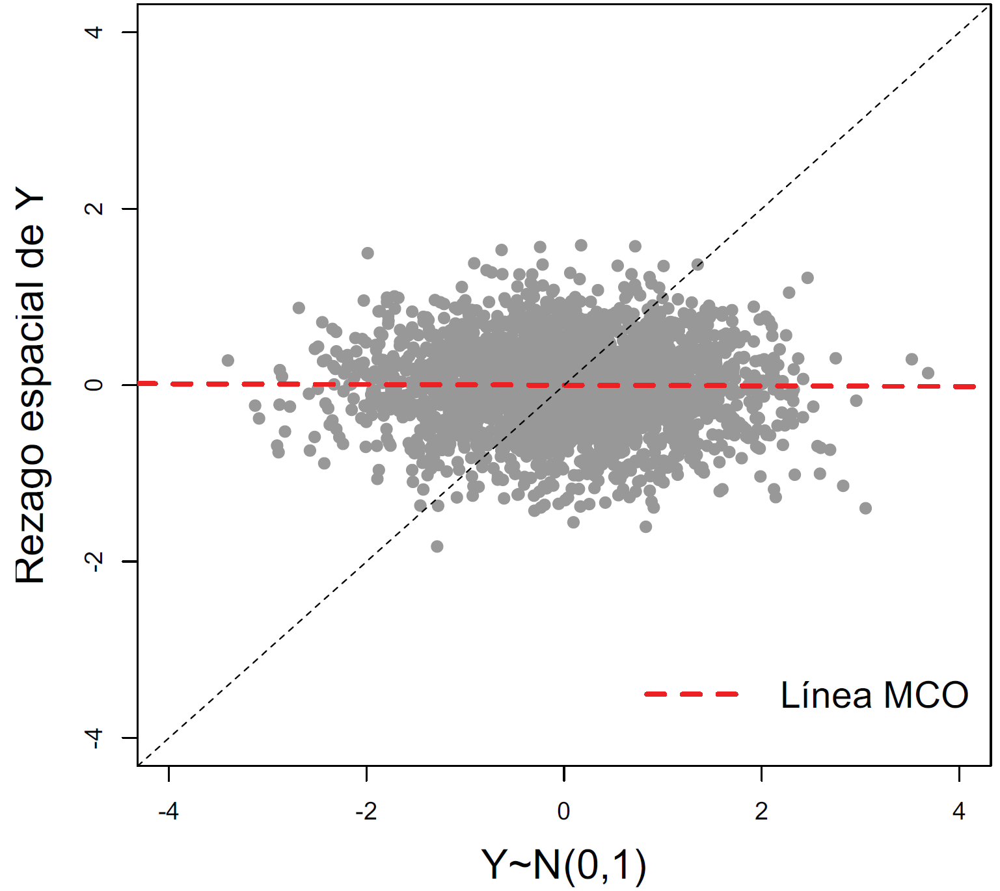
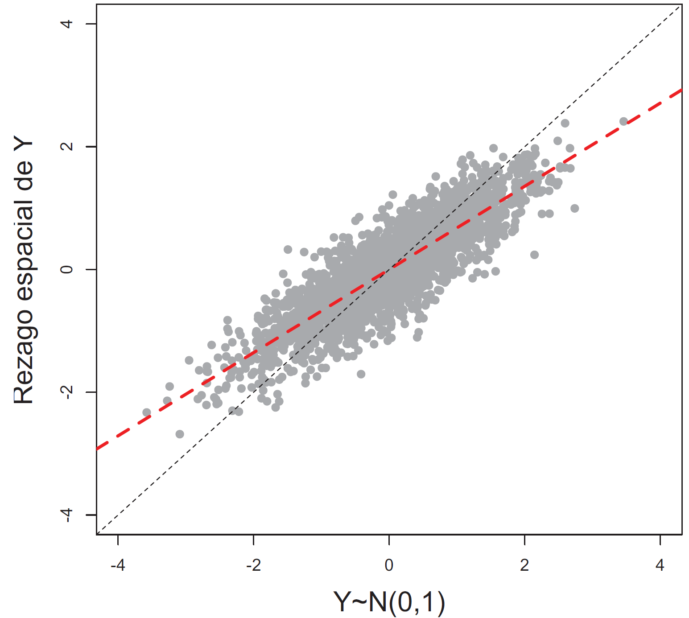
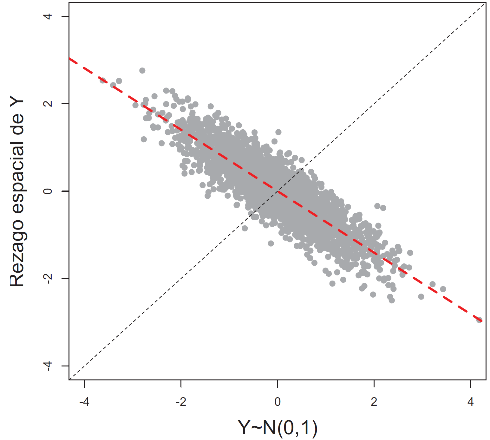
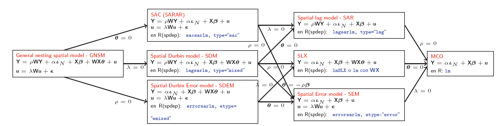
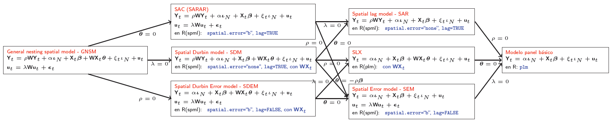
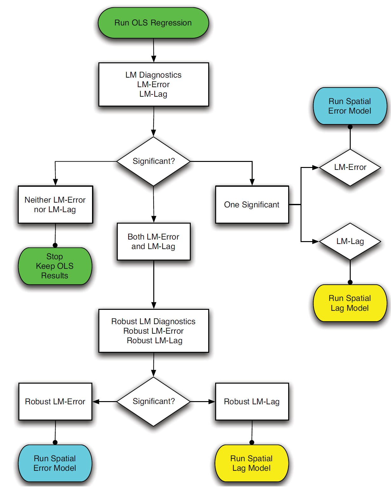
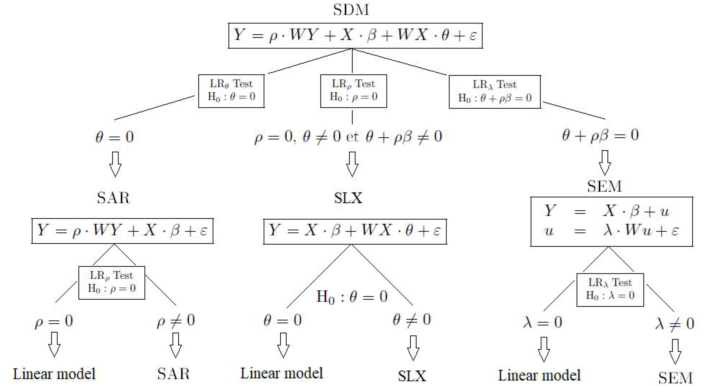
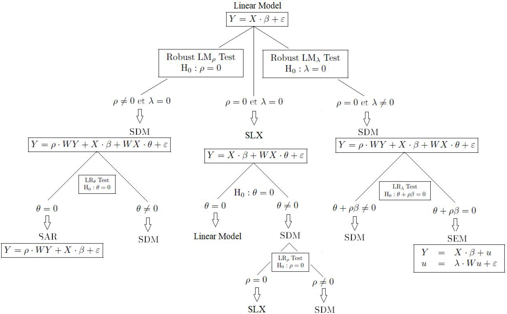
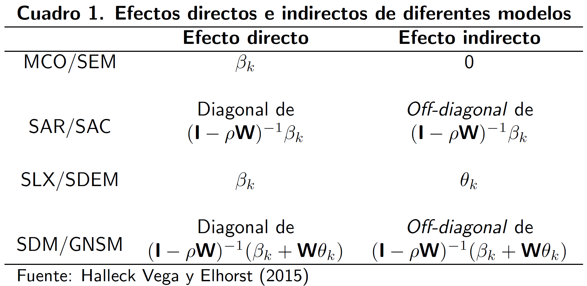

```{r setup, include = F}
# This is the recommended set up for flipbooks
# you might think about setting cache to TRUE as you gain practice --- building flipbooks from scratch can be time consuming
options(width = 70)
knitr::opts_chunk$set(
  dev.args = list(bg = 'transparent'),
  fig.width = 12, message = TRUE,
  warning = FALSE, comment = "", cache = TRUE, fig.retina = 3
)
knitr::opts_knit$set(global.par = TRUE)
Sys.setenv(`_R_S3_METHOD_REGISTRATION_NOTE_OVERWRITES_` = "false")
# remotes::install_github("luukvdmeer/sfnetworks")
# remotes::install_github("EvaMaeRey/flipbookr")
# remotes::install_github("rlesur/klippy")
# devtools::install_github("gadenbuie/xaringanExtra")
library(flipbookr)
library(xaringanthemer)
library(tidyverse)
library(klippy)
library(xaringanExtra)
library(gt); library(knitr); library(kableExtra); library(tibble)
library(summarytools)
```

<style>
.notbold{
    font-weight:normal
}

body {
text-align: justify;
}

h1{
      margin-top: -1px;
      margin-bottom: -3px;
}

.small-code pre{
  margin-bottom: -10px;
  
}  

.medium-code pre{
  margin-bottom: 2px;
  
}

p.comment {
background-color: #E1E1FF;
padding: 10px;
border: 1px solid white;
margin-left: 25px;
border-radius: 15px;
text-align: justify;
}

div.block { 
background-color: #E1E1FF;
padding: 10px;
border: 1px solid white;
margin-left: 25px;
border-radius: 15px;
text-align: justify;
}

</style>

```{r xaringan-scribble, echo=FALSE}
xaringanExtra::use_scribble()
```

```{r xaringanExtra-clipboard, echo=FALSE}
htmltools::tagList(
  xaringanExtra::use_clipboard(
    button_text = "<i class=\"fa fa-clipboard\"></i>",
    success_text = "<i class=\"fa fa-check\" style=\"color: #90BE6D\"></i>",
    error_text = "<i class=\"fa fa-times-circle\" style=\"color: #F94144\"></i>"
  ),
  rmarkdown::html_dependency_font_awesome()
)
```

```{r xaringan-extra-styles, echo=FALSE}
xaringanExtra::use_extra_styles(
  hover_code_line = TRUE,         #<<
  mute_unhighlighted_code = TRUE  #<<
)
```
<font size = "5">

<br>
<br>
<br>
<br>
<br>

Link slides en formato [html](https://gusgarciacruz.github.io/EconometriaEspacial/RegEspacial/RegEspacial.html)

Link slides en formato [PDF](https://gusgarciacruz.github.io/EconometriaEspacial/RegEspacial/RegEspacial.pdf)

---
# <span style="font-size:80%">En este tema</span>

- <span style="font-size:150%">[<span style="color:black">Motivación](#motivacion)</span> <br>

- <span style="font-size:150%">[<span style="color:black">Taxonomía de los modelos lineales con dependencia espacial](#tax)</span> <br>

- <span style="font-size:150%">[<span style="color:black">Ineficiencia de los estimadores MCO](#inefi)</span> <br>

- <span style="font-size:150%">[<span style="color:black">Métodos de estimación](#metodos)</span> <br>

- <span style="font-size:150%">[<span style="color:black">Comparación de modelos](#modelos)</span> <br>

- <span style="font-size:150%">[<span style="color:black">Efectos directos e indirectos (o *spatial spillover effects*)](#spillover)</span> <br>
  
- <span style="font-size:150%">[<span style="color:black">Ejercicio aplicado en R: corte transversal](#r1)</span> <br> 

- <span style="font-size:150%">[<span style="color:black">Ejercicio aplicado en R: datos panel](#r2)</span>

---
# <span style="font-size:80%">Lecturas</span>
<font size = "5">

- Elhorst, J.P. (2010). "Applied Spatial Econometrics: Raising the Bar". *Spatial Economic Analysis*, 5(1):9–28

- Millo, G. y Piras, G. (2012). "splm: Spatial Panel Data Models in R". *Journal of Statistical Software*, 47(1):1–37

- Elhorst, J.P. (2014). *Spatial Econometrics from Cross-Sectional Data to Spatial Panels*, Springer

- LeSage, J. y Pace, R. (2014). "Interpreting spatial econometrics models". En Fischer, M. y Nijkamp, P. (Eds.), *Handbook of Regional Science*, Springer

- Halleck Vega, S. y Elhorst, J.P. (2015). "The SLX model",  *Journal of Regional Science*,  55(3):339-363

- Golgher, A. y Voss, P. (2016). "How to interpret the coefficients of spatial models: spillovers, direct and indirect Effects". *Spatial Demography*, 4:175–205

- Belotti, F., Hughes, G. y Mortari, A. (2017). "Spatial panel-data models using Stata",  *The Stata Journal*,  17(1):139-180.

---
name: motivacion
# <span style="font-size:80%">Motivación</span>
<font size = "5">

**<span style="color:blue">PGD no espacial</span>**

En el caso lineal:
$$y_{i}=\textbf{x}_{i}\boldsymbol\beta+u_{i}$$
$$u_{i}\sim N(0,\sigma^2), i=1,...,n$$
Supuestos:
<p style="margin-bottom: -1em">
- Los valores observados en la localización *i* son independientes de aquellos en la localización *j*

- Los residuales son independientes $\Longrightarrow E[u_{i}u_{j}]=E[u_{i}]E[u_{j}]=0$

El supuesto de independencia simplifica enormemente el modelo, pero puede ser difícil de justificar en algunos contextos 

---
# <span style="font-size:80%">Motivación</span>
<font size = "5">

**<span style="color:blue">PGD no espacial</span>**

Con dos vecinos $i$ y $j$:

$$y_{i}=\alpha_{j}y_{j}+\textbf{x}_{i}\boldsymbol\beta+u_{i}$$
$$y_{j}=\alpha_{i}y_{i}+\textbf{x}_{j}\boldsymbol\beta+u_{j}$$
$$u_{i}\sim N(0,\sigma^2), i=1$$
$$u_{j}\sim N(0,\sigma^2), j=2$$
Supuestos:
<p style="margin-bottom: -1em">
- Los valores observados en la localización *i* dependen de aquellos en la localización *j* y viceversa

- El PGD es "simultáneo"

---
# <span style="font-size:80%">Motivación</span>
<font size = "5">

**<span style="color:blue">PGD espacial</span>**

Con $n$ observaciones, se puede generalizar:

$$y_{i}=\rho \displaystyle\sum_{j=1}^{n} w_{ij}y_{j}+\textbf{x}_{i}\boldsymbol\beta+u_{i}$$
$$u_{i}\sim N(0,\sigma^2), i=1,...,n$$
En notación matricial:
$$\textbf{Y}=\rho \textbf{W}\textbf{Y}+\textbf{X}\boldsymbol\beta+\textbf{u}$$
$$\textbf{u}\sim N(0,\sigma^2\textbf{I}_{n}), i=1,...,n$$
donde $\textbf{W}$ es la matriz de pesos espaciales, $\rho$ es un parámetro escalar de autocorrelación espacial e $\textbf{I}_{n}$ es una matriz identidad $n\times n$

---
# <span style="font-size:80%">Motivación</span>
<spam style="font-size:110%">

**<span style="color:blue">PGD espacial</span>**

- Cuando $\rho=0$, la variable no es espacialmente autocorrelacionada. La información sobre una medida en una localización no nos da información de los valores de las localizaciones vecinas $\Longrightarrow$ <span style="color:blue">independencia espacial

- Cuando $\rho>0$, la variable es positivamente autocorrelacionada espacialmente. Valores vecinos tienden a ser similares unos a otros $\Longrightarrow$ <span style="color:blue">clustering 

- Cuando $\rho<0$, la variable es negativamente autocorrelacionada espacialmente. Valores vecinos tienden a ser diferentes unos a otros $\Longrightarrow$ <span style="color:blue">segregación

.left-column[
<center>
$\rho=0$
```{r, echo=FALSE, out.width="90%",fig.align='center'}

```
]

.left-column[
<center>
$\rho>0$
```{r, echo=FALSE, out.width="90%",fig.align='center'}

```
]

.left-column[
<center>
$\rho<0$
```{r, echo=FALSE, out.width="90%",fig.align='center'}

```
]

---
name: tax
# <span style="font-size:80%">Taxonomía de los modelos lineales con dependencia espacial</span>
<font size = "5">

Manski (1993) resalta que existen tres diferentes tipos de efectos interactivos que pueden explicar por qué una observación asociada con una localización específica puede depender de otra localización:

1. <span style="color:blue">Efectos de interacción endógenos</span>: donde el comportamiento de una unidad espacial (o sus tomadores de decisiones) en una localización depende de la decisión tomada por otras unidades espaciales

2. <span style="color:blue">Efectos de interacción exógenos</span>: donde el comportamiento de una unidad espacial en una localización depende variables explicativas independientes, de otra unidad espacial

3. <span style="color:blue">Efectos correlacionados</span>: donde similares características no observadas dan como resultado un comportamiento similar

---
# <span style="font-size:80%">Taxonomía de los modelos lineales con dependencia espacial</span>
<spam style="font-size:120%">

El modelo de Manski (1993) o modelo más general (<span style="color:blue">*General Nesting spatial model - GNSM*</span>) en tiene la forma:

$$\textbf{Y}=\rho \textbf{W}\textbf{Y} + \alpha\boldsymbol\iota_{N} + \textbf{X}\boldsymbol\beta + \textbf{W}\textbf{X}\boldsymbol\theta + \textbf{u}$$
$$\textbf{u}=\lambda \textbf{W}\textbf{u} + \boldsymbol\epsilon$$
$\textbf{W}\textbf{Y}$: efectos de interacción endógenos entre las variables dependientes  
$\textbf{W}\textbf{X}$: efectos de interacción exógenos entre las variables independientes  
$\textbf{Wu}$: efectos de interacción entre los términos de error de las diferentes unidades espaciales  
$\rho$: coeficiente espacial autorregresivo  
$\lambda$: coeficiente espacial de autocorrelación  
$\theta$ y $\beta$: vectores $K\times 1$ de parámetros fijos y desconocidos

El modelo <span style="color:blue">espacio-tiempo</span> se extiende con efectos específicos espaciales y de tiempo, y tiene la forma:

$$\textbf{Y}_t=\rho \textbf{W}\textbf{Y}_t + \alpha\boldsymbol\iota_{N} + \textbf{X}_t\boldsymbol\beta + \textbf{W}\textbf{X}_t\boldsymbol\theta + \boldsymbol\mu + \xi_t\iota_{N} + \textbf{u}_t$$
$$\textbf{u}_t=\lambda \textbf{W}\textbf{u}_t + \boldsymbol\epsilon_t$$
donde $\boldsymbol\mu=(\mu_1,...,\mu_N)'$. Los efectos específicos de espacio y tiempo pueden ser tratados como efectos fijos o efectos aleatorios

---
# <span style="font-size:80%">Taxonomía de los modelos lineales con dependencia espacial</span>
<font size = "5">

El siguiente diagrama resume una familia de 8 modelos econométricos lineales espaciales en <span style="color:blue">sección cruzada:

```{r, echo=FALSE, out.width="150%",fig.align='center'}

```

---
# <span style="font-size:80%">Taxonomía de los modelos lineales con dependencia espacial</span>
<font size = "5">

El siguiente diagrama resume una familia de 8 modelos econométricos lineales espaciales en <span style="color:blue">datos panel</span> (con efectos fijos o aleatorios, y con o sin efectos específicos de tiempo):

```{r, echo=FALSE,out.width="150%", fig.align='center'}

```

---
name: inefi
# <span style="font-size:80%">Ineficiencia de los estimadores MCO</span>
<spam style="font-size:120%">

- En un contexto de series de tiempo, los estimadores MCO siguen siendo consistentes incluso cuando la variable dependiente rezagada esta presente en el modelo, siempre que el términos de error no muestre correlación serial

- Mientras el estimador puede ser sesgado en muestras pequeñas, éste puede aún ser usado para inferencia asintótica

- En un contexto espacial, estas reglas no se mantienen, independientemente de las propiedades del término de error

- Consideremos el modelo SAR de primer orden en corte transversal (covariables omitidas):

$$\textbf{Y}=\rho \textbf{W}\textbf{Y} + \boldsymbol\epsilon$$
- El estimador MCO para $\rho$ es:

$$\widehat{\rho} = \left((\textbf{W}\textbf{Y})'(\textbf{W}\textbf{Y})\right)^{-1} (\textbf{W}\textbf{Y})'\textbf{Y} = \rho + \left((\textbf{W}\textbf{Y})'(\textbf{W}\textbf{Y})\right)^{-1} (\textbf{W}\textbf{Y})'\boldsymbol\epsilon$$
- Similar a series de tiempo, la esperanza del segundo término no es igual a cero

---
# <span style="font-size:80%">Ineficiencia de los estimadores MCO</span>
<font size = "5">

- Asintóticamente, el estimador MCO será consistente si se cumplen dos condiciones:
$$\text{plim } N^{-1}(\textbf{W}\textbf{Y})'(\textbf{W}\textbf{Y})=\textbf{Q}\text{ una matriz finita no singular}$$ 
$$\text{plim } N^{-1}(\textbf{W}\textbf{Y})'\boldsymbol\epsilon=\textbf{0}$$
- Si bien la primera condición se puede satisfacer con restricciones adecuadas sobre $\rho$ y la estructura de $\textbf{W}$, la segunda no se mantiene en el caso especial:

$$\text{plim }N^{-1}(\textbf{W}\textbf{Y})'\boldsymbol\epsilon=\text{plim } N^{-1}\boldsymbol\epsilon'(\textbf{W})(\textbf{I}_{N}-\rho \textbf{W})^{-1}\boldsymbol\epsilon \neq \textbf{0}$$
- La presencia de $\textbf{W}$ en la expresión resulta en una forma cuadrática en el término de error

- A menos que $\rho=0$, el $\text{plim}$ no convergerá a cero

---
name: metodos
# <span style="font-size:80%">Métodos de estimación</span>
<font size = "5">

Tres métodos han sido desarrollados en la literatura para estimar modelos que incluyen efectos de interacción espacial:

- ML: Máxima verosimilitud

- IV/GMM: variables instrumentales o método de los momentos generalizados

- MCMC: *Bayesian Markov Chain Monte Carlo approach*

---
name: modelos
# <span style="font-size:80%">Comparación de modelos</span>
<spam style="font-size:130%">

- El esquema de los 7 modelos espaciales parece sugerir que la mejor estrategia para probar por efectos de interacción espacial es iniciar por el modelo general: $GNSM$

- Sin embargo, como Manski (1993) plantea, al menos uno de los $K+2$ efectos de interacción debe ser excluido, ya que de otra forma los parámetros no podrán ser identificados $\Longrightarrow$ De acuerdo a Manski (1993) no existen limitaciones técnicas para estimar el modelo, pero los parámetros estimados no podrán interpretarse de manera adecuada, ya que los efectos endógenos y exógenos no pueden distinguirse entre sí

- Se esta divido entonces en aplicar dos enfoques: general-a-específico o específico-a-general

- LeSage y Pace (2009) argumentan que el modelo Durbin espacial es el mejor punto de partida

- Florax et al. (2003) han encontrado que una expansión de una ecuación de regresión lineal con variables espacialmente rezagadas, condicional a los resultados sobre pruebas de especificación incorrectas, supera el enfoque general-a-específico para encontrar el verdadero proceso generador de datos

---
# <span style="font-size:80%">Comparación de modelos</span>
<spam style="font-size:115%">

Partiendo del siguiente modelo de regresión lineal:
$$\textbf{Y} = \textbf{X}\boldsymbol\beta + \boldsymbol\epsilon$$
$$\boldsymbol\epsilon \sim N(\textbf{0},\sigma^{2}\textbf{I})$$
La hipótesis de no autocorrelación espacial puede ser contrastada a partir de los siguientes estadísticos:  
<p style="margin-bottom: -1em">
- La I de Moran

- Tests estadísticos basados en el principio de multiplicadores de Lagrange (LM):
<p style="margin-bottom: -1em">
  - LM-Lag
	- Robust LM-Lag
	- LM-Error
	- Robust LM-Error
	- LM-SARMA
	
- En los tests LM los dos primeros se refieren al *spatial lag model* como alternativa, los siguientes dos se refieren al *spatial error model* como alternativa y el último se refiere a un modelo con *spatial lag* y *spatial error*

---
# <span style="font-size:80%">Comparación de modelos</span>
<spam style="font-size:115%">

- Todos los tests comparten una misma hipótesis nula: la ausencia de dependencia espacial

- Sin embargo, el test de la I de Moran no tiene una hipótesis alternativa claramente definida. Con lo cual no sirve para discriminar entre la existencia de un esquema de autocorrelación espacial residual o en la variable dependiente

- Por otra parte, tanto la I de Moran como los contrastes basados en el principio de LM requieren de la normalidad del término de perturbación así como la linealidad del modelo de regresión

- Los tests robustos (Robust LM-Lag y Robust LM-Error) prueban la dependencia espacial robusto a la presencia del otro. Es decir, que el Robust LM-Error prueba por dependencia en el error en la posible presencia errónea de una variable endógena retardada espacialmente, y el Robust LM-Lag al revés

- Lo importante a recordar respecto a los tests robustos es que estos sólo deben considerarse cuando la versión estándar (LM-Lag o LM-Error) son estadísticamente significativos

- Los tests robustos ayudan a determinar que tipo de dependencia espacial existe. Si las medidas robustas de lag y error son ambas significativas, la estructura de la autocorrelación espacial estará determinada por el test robusto con mayor valor

---
# <span style="font-size:80%">Comparación de modelos</span>
<font size = "5">
La estrategia simple propuesta por Anselin (2005) y Florax et al (2003) es (*<span style="color:blue">The bottom-up approach</span>*):

```{r, echo=FALSE,out.width="37%", fig.align='center'}

```

---
# <span style="font-size:80%">Comparación de modelos</span>
<font size = "5">

La estrategia de LeSage y Pace (2009) (*<span style="color:blue">The top-down approach</span>*):

```{r, echo=FALSE,out.width="80%", fig.align='center'}

```

---
# <span style="font-size:80%">Comparación de modelos</span>
<font size = "5">
La estrategia de Elhorst (2010):

```{r, echo=FALSE,out.width="73%", fig.align='center'}

```

---
# <span style="font-size:80%">Comparación de modelos</span>
<spam style="font-size:96%">

Por tanto, Elhorst (2010) propone el siguiente procedimiento para determinar qué modelo es el candidato más probable para explicar los datos:

1. Estime el modelo por MCO y pruebe si el *spatial lag model - SAR* o el *spatial error model - SEM* es más apropiado para describir los datos. Para esto, se puede utilizar el LM-test propuesto por Anselin (1988) y el robust LM-test propuesto por Anselin et al. (1996)

2. Si el modelo MCO es rechazado en favor del *spatial lag model*, *spatial error model* o en favor de ambos modelos, entonces el modelo Durbin espacial debería ser estimado

3. Si estos modelos son estimados por ML, un LR test puede ser usado para probar las hipótesis:
<p style="margin-bottom: -1em">
 - $H_{0}: \theta=0 \Longrightarrow$ prueba si el modelo Durbin espacial se puede simplificar en el *spatial lag model*  
<p style="margin-bottom: -1em">
 - $H_{0}:\theta+\rho\beta=0 \Longrightarrow$ prueba si el modelo Durbin espacial se puede simplificar en el *spatial error model*
				
	 - Si $H_{0}:\theta=0$ y $H_{0}: \theta+\rho\beta=0$ son rechazadas $\Longrightarrow$ modelo Durbin espacial
	 - Si $H_{0}: \theta=0$ no puede ser rechazada $\Longrightarrow$ *spatial lag model* (siempre que el (robust) LM-test diga lo mismo)
	 - Si $H_{0}: \theta+\rho\beta=0$ no puede ser rechazada $\Longrightarrow$ *spatial error model* (siempre que el (robust) LM-test diga lo mismo)
	 - Si el (robust) LM-test a punta a un modelo diferente que el LR test $\Longrightarrow$ modelo Durbin espacial

4. Si el modelo MCO es estimado y no rechaza en favor del *spatial lag model* y el *spatial error model*, el modelo MCO deberá ser re-estimado incluyendo $\textbf{WX}$ o una particular selección de estas $K$ variables para probar $H_{0}: \theta=0$

 - Si la hipótesis no puede ser rechazada $\Longrightarrow$ modelo MCO
 - Si la hipótesis es rechazada $\Longrightarrow$ modelo Durbin espacial y se debe contrastar $H_{0}: \rho=0$
 - Si ésta última hipótesis es rechazada $\Longrightarrow$ modelo Durbin espacial 
 - Si ésta última hipótesis es no rechazada $\Longrightarrow$ modelo SLX
 
---
name: spillover
# <span style="font-size:80%">Efectos directos e indirectos (o *spatial spillover effects*)</span>
<spam style="font-size:135%">

- Muchos estudios empíricos usan las estimaciones puntuales de una o más especificaciones de modelos de regresión espacial $(\rho$, $\theta$ y/o $\lambda)$ para deducir conclusiones sobre la existencia de spillovers espaciales $\Longrightarrow$ <span style="color:blue">LeSage y Pace (2009, p. 74) plantean y demuestran que esta práctica lleva a erróneas conclusiones

- Re-escribiendo el modelo *GNSM*:
$$\textbf{Y} = (\textbf{I}-\rho \textbf{W})^{-1}(\textbf{X}\boldsymbol\beta+\textbf{W}\textbf{X}\boldsymbol\theta) + \textbf{R}$$
donde $\textbf{R}$ es un término que contiene el intercepto y el término de error, la matriz de derivadas parciales del valor esperado de $\textbf{Y}$ con respecto a la $k$-ésima variable explicatoria de $\textbf{X}$ es:

$$\left[ \begin{array}{ccc}
\frac{\partial E(\textbf{Y})}{\partial x_{1k}} &  . & \frac{\partial E(Y)}{\partial x_{Nk}}\end{array} \right] = \left[ \begin{array}{ccc}
\frac{\partial E(y_{1})}{\partial x_{1k}} &  . & \frac{\partial E(y_{1})}{\partial x_{Nk}}\\
.                                         &  . & .                                        \\
\frac{\partial E(y_{N})}{\partial x_{1k}} &  . & \frac{\partial E(y_{N})}{\partial x_{Nk}} \end{array} \right]=(\textbf{I}-\rho \textbf{W})^{-1} \left[ \begin{array}{cccc}
\beta_{k}        &  w_{12}\theta_{k} & . & w_{1N}\theta_{k}\\
w_{21}\theta_{k} &  \beta_{k}        & . & w_{2N}\theta_{k}\\
.                &       .           & . & .\\
w_{N1}\theta_{k} &  w_{N2}\theta_{k} & . & \beta_{k} \end{array} \right]$$

---
# <span style="font-size:80%">Efectos directos e indirectos (o *spatial spillover effects*)</span>
<spam style="font-size:120%">

Esta derivada parcial tiene tres importantes propiedades:
1. Si una variable explicatoria particular en una unidad espacial particular cambia, no sólo cambiará la variable dependiente en esa unidad espacial, sino también cambiará en otras unidades espaciales
 - El primer cambio se llama <span style="color:blue">efecto directo</span>: cada elemento de la diagonal
<p style="margin-bottom: -1em">
 - El segundo cambio se llama <span style="color:blue">efecto indirecto</span>:  cada elemento por fuera de la diagonal  <p style="margin-bottom: .5em">
 Los efectos indirectos no ocurren si $\rho=0$ y $\theta_{k}=0$, ya que los elementos por fuera de la diagonal serían cero

2. Los efectos directos e indirectos son diferentes para diferentes unidades espaciales en la muestra
<p style="margin-bottom: -1em">
 - Los efectos directos son diferentes ya que los elementos de la diagonal de la matriz $(\textbf{I}-\rho \textbf{W})^{-1}$ son diferentes para cada unidad espacial, siempre que $\rho\neq 0$
 - Los efectos indirectos son diferentes ya que los elementos de la diagonal de la matriz $(\textbf{I}-\rho \textbf{W})^{-1}$ y de la matriz $\textbf{W}$ son diferentes entre unidades espaciales, siempre que $\rho\neq 0$ y/o $\theta_{k}\neq 0$
	
3. Los efectos indirectos que ocurren si $\theta_{k}\neq 0$ son conocidos como <span style="color:blue">efectos locales</span>, como opuesto al efecto indirecto que ocurre si $\rho\neq 0$ que son llamados <span style="color:blue">efectos globales</span>

---
# <span style="font-size:80%">Efectos directos e indirectos (o *spatial spillover effects*)</span>
<spam style="font-size:120%">

- Ya que los efectos directos e indirectos son diferentes para diferentes unidades espaciales, la presentación de estos efectos puede ser problemático $\Longrightarrow$ $N$ unidades espaciales y $K$ variables explicatorias, se obtiene $K$ diferentes $N\times N$ matrices de efectos directos e indirectos

- LeSage y Pace (2009) proponen lo siguiente:
<p style="margin-bottom: -1em">
 - <span style="color:blue">Efectos directos</span>: promedio de los elementos de la diagonal de la matriz
 - <span style="color:blue">Efectos indirectos</span>: promedio de las filas o las columnas de los elementos por fuera de la diagonal

- <span style="color:blue">Promedio de las filas</span>: el impacto sobre un particular unidad espacial de la variable dependiente ante un cambio en todas las variables explicatorias en todas las unidades espaciales

- <span style="color:blue">Promedio de las columnas</span>: el impacto de cambiar la variable explicatoria en una unidad espacial sobre la variable dependiente de todas las unidades espaciales

- <span style="color:blue">Sin embargo, numéricamente las dos magnitudes son iguales, por lo cual no importa por cual se opte

- <span style="color:blue">Interpretación del efecto indirecto</span>: el impacto de cambiar un particular elemento de una variable exógena sobre la variable dependiente de todas las otras unidades espaciales, lo cual corresponde al promedio del efecto columna

---
# <span style="font-size:80%">Efectos directos e indirectos (o *spatial spillover effects*)</span>
<font size = "5">


```{r, echo=FALSE,out.width="73%", fig.align='center'}

```

---
name: r1
# <span style="font-size:80%">Ejercicio aplicado en R: corte transversa</span>
<font size = "5">

En este ejercicio aplicado se va analizar los determinantes de la tasa de vivienda propia para NYC a nivel de Census track. En los siguientes links se encuentran el shapefile y el código utilizado en R: 

- [Shapefile](https://gusgarciacruz.github.io/EconometriaEspacial/RegEspacial/nyc2000.zip)
- [Código en R](https://gusgarciacruz.github.io/EconometriaEspacial/RegEspacial/L6_2.R)

---
name: r2
# <span style="font-size:80%">Ejercicio aplicado en R: datos panel</span>
<font size = "5">

En este ejercicio aplicado se va analizar los crímenes violentos en los estados de los Estados Unidos. En los siguientes links se encuentran los datos, el shapefile y el código utilizado en R: 

- [Datos](https://gusgarciacruz.github.io/EconometriaEspacial/RegEspacial/crimes_ts.csv)
- [Shapefile](https://gusgarciacruz.github.io/EconometriaEspacial/RegEspacial/cb_2018_us_state_5m.zip)
- [Código en R](https://gusgarciacruz.github.io/EconometriaEspacial/RegEspacial/L7.R)